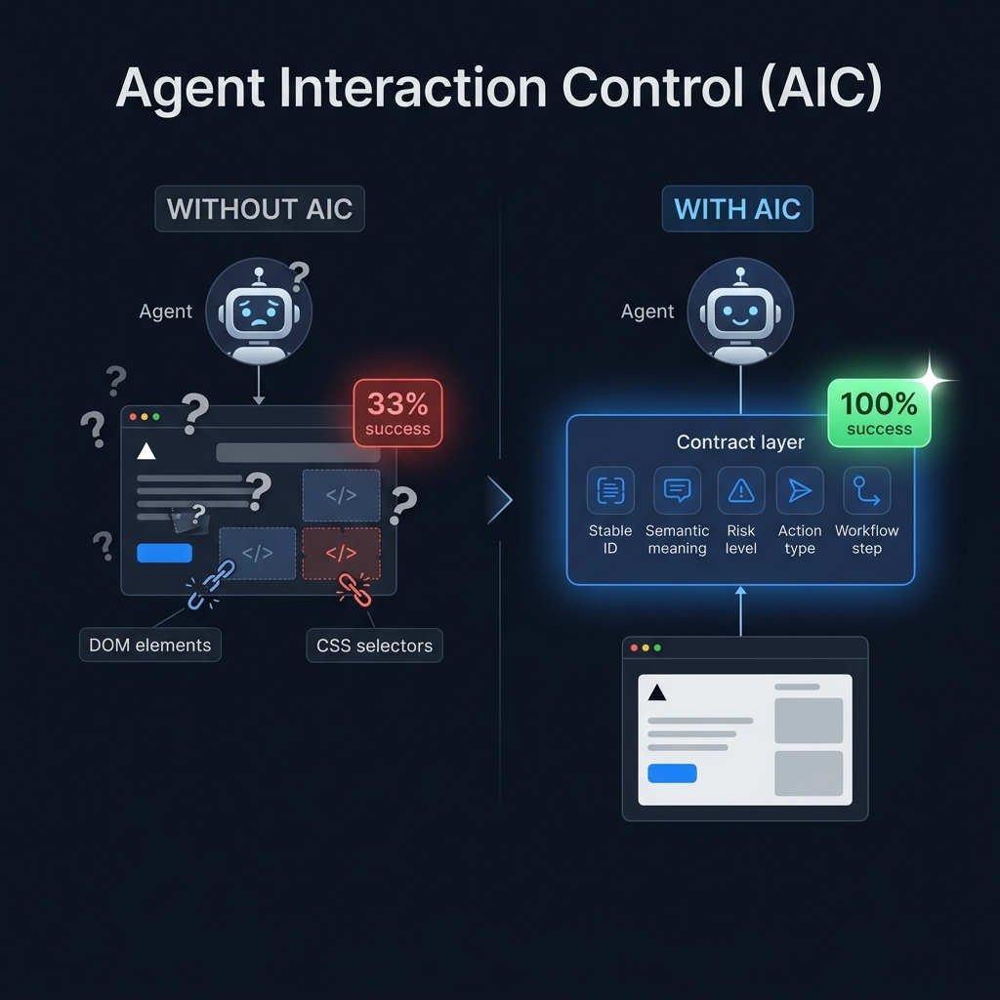
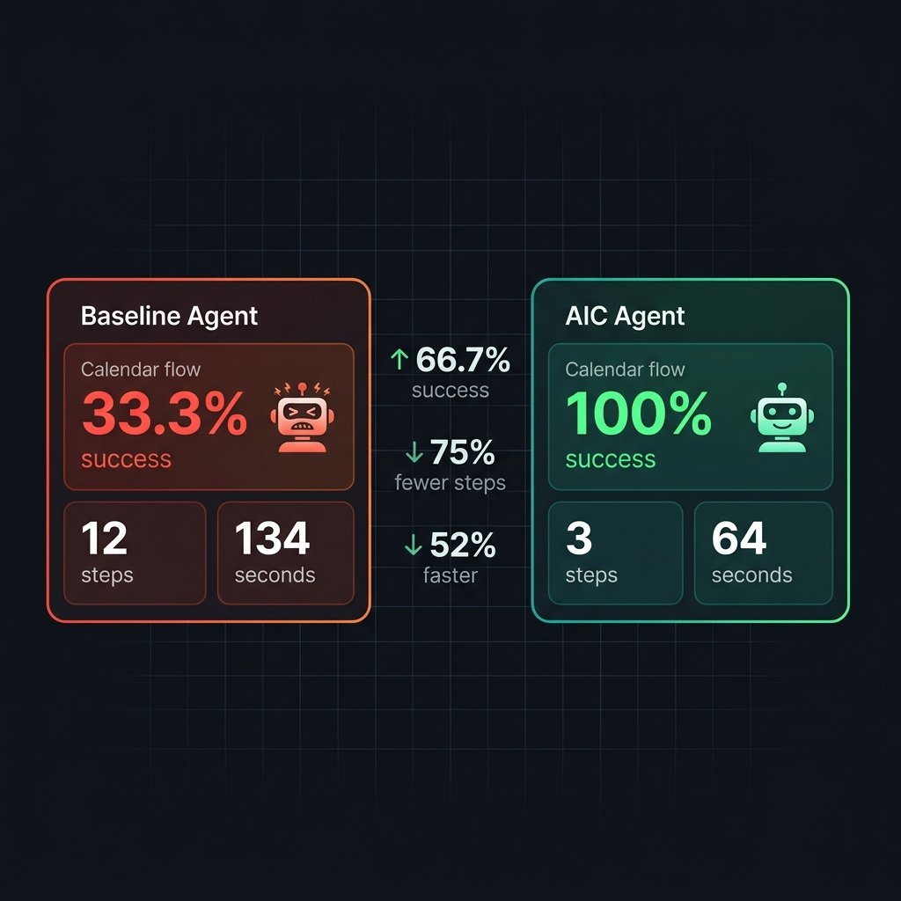

<div align="center">

# 🤖 AIC — Agent Interaction Control

**Give your web app a stable, machine-readable interface for AI agents.**

[](https://www.npmjs.com/package/@aicorg/cli)
[](./LICENSE)
[](./docs/implementation-phases.md)
[](./docs/mcp-server.md)

---

*Stop letting AI agents guess. Give them something real to work with.*

</div>

---

## 🧠 Wait — What Problem Does AIC Solve?

You know how AI assistants like Claude, Cursor, or Copilot sometimes try to operate your web app — and they click the wrong button, fill in the wrong field, or fail completely? That's not entirely the AI's fault.

**The real problem:** web apps are built for human eyes, not machine understanding. An AI agent looking at your app sees the same thing a blindfolded person feels when touching a wall — it can sense *something* is there, but has no idea *what* it means.

Today, agents rely on:
- 🎲 **Brittle CSS selectors** — break whenever the UI changes
- 👁️ **Screenshots** — the agent reads pixels and guesses
- 📝 **Button text matching** — "the thing that says Submit"
- 🔢 **Coordinate clicks** — literally clicking at X, Y on screen

These approaches fail unpredictably. They retry wrong elements, misfire modals, and guess at risky actions without knowing the stakes.

**AIC is the fix.** It gives your app a way to *publish* what each control means — its identity, its purpose, its risk level, what workflow it belongs to — so agents can operate it reliably instead of guessing.

> 💡 **The key idea:** expose what the page *means*, not just what it looks like.

---



---

## ⚡ The Proof Is In The Numbers

We ran a real browser agent benchmark on the [TailAdmin dashboard](./examples/tailadmin-dashboard) using **Claude Sonnet 4.6**. Here's what happened:



### 📅 Calendar Event Creation

| Metric | Baseline Agent | AIC-Powered Agent | Improvement |
|--------|:--------------:|:-----------------:|:-----------:|
| ✅ Success Rate | 33.3% | **100%** | +66.7pp |
| ⏱️ Median Time | 134s | **64s** | 52% faster |
| 🖱️ Median Steps | 12 | **3** | 75% fewer |
| 🔁 Retries | 2 | **0** | 100% reduction |

### 👤 Profile Edit

| Metric | Baseline Agent | AIC-Powered Agent | Improvement |
|--------|:--------------:|:-----------------:|:-----------:|
| ✅ Success Rate | 100% | **100%** | maintained |
| ⏱️ Median Time | 99s | **70s** | 29% faster |
| 🖱️ Median Steps | 20 | **6** | 70% fewer |

> These are real browser-agent runs — not synthetic tests, not simulations. The agent opened a browser, navigated the UI, filled forms, and verified results. [Full report →](./docs/tailadmin-benchmark-claude-2026-04-02.md)

We also ran a real-app adoption benchmark on a patched local fork of **Twenty CRM**. The current official measured slice is green on detail navigation, destructive safety, record-scoped note creation, record-scoped task creation, a list-level sort workflow, a full list-level filter workflow, record-level stage mutation, and active filter clear, with AIC improving contract correctness from `0.40 -> 0.90` on detail navigation, from `0.60 -> 1.00` on destructive cancel, from `0.35 -> 0.95` on note creation, from `0.40 -> 0.95` on task creation, from `0.45 -> 0.95` on list sort plus record open, from `0.50 -> 0.95` on list filter plus record open, from `0.50 -> 0.90` on stage mutation, and from `0.55 -> 1.00` on list filter clear. [Twenty report →](./benchmarks/twenty-adoption/benchmark-report-official.md)

---

## 🗺️ How AIC Works

AIC adds a thin layer of *explicit semantics* to your app. Think of it as giving every important control a name tag, a job description, and a risk rating — in a format that agents can read directly.

### Step 1: You annotate your controls

```tsx
// Before AIC — an agent has to guess what this does
<button onClick={handleDelete}>Delete</button>

// After AIC — the agent knows exactly what this is
<button
  onClick={handleDelete}
  agentId="order.delete"
  agentAction="submit"
  agentDescription="Permanently deletes the selected order"
  agentRisk="critical"
  agentRequiresConfirmation
  agentConfirmation={{
    type: "human_review",
    prompt_template: "Delete the selected order. This cannot be undone."
  }}
>
  Delete
</button>
```

### Step 2: AIC turns annotations into agent-readable manifests

Run one command and AIC generates a suite of artifacts:

```
/.well-known/agent.json          ← app identity & capabilities
/.well-known/agent/ui            ← live UI manifest (what's on screen right now)
/.well-known/agent/actions       ← semantic action contracts
agent-permissions.json           ← who can do what
agent-workflows.json             ← multi-step flow definitions
operate.txt                      ← plain-English operation guide
```

### Step 3: Agents use manifests instead of guessing

Instead of scraping the DOM, an agent queries the AIC manifest, finds `order.delete`, reads its risk level and confirmation requirements, and executes it correctly — every time.

```
Agent: "Which element deletes an order?"
AIC:   "agentId=order.delete, risk=critical, confirmation required"
Agent: ✅ Executes safely
```

---

## 🚀 Quick Start

### Connect any MCP-compatible AI agent (Claude Desktop, Cursor, etc.)

```json
{
  "mcpServers": {
    "aic": {
      "command": "npx",
      "args": ["-y", "@aicorg/mcp-server"]
    }
  }
}
```

That's it. Your agent now has **6 read-only tools** to discover app capabilities, inspect elements, filter by risk/role/entity, read permissions and workflows, and understand semantic action contracts.

→ [Full MCP setup guide](./docs/mcp-server.md)

### Instrument your React/Next/Vite app

```bash
npx @aicorg/cli init ./my-app
```

Then annotate your important controls using the React SDK:

```bash
npm install @aicorg/sdk-react
```

```tsx
import { useAICElement } from '@aicorg/sdk-react';

const { attributes } = useAICElement({
  agentId: 'checkout.submit',
  agentAction: 'submit',
  agentDescription: 'Completes the purchase',
  agentRisk: 'high',
});

<button {...attributes} onClick={handleCheckout}>
  Complete Purchase
</button>
```

→ [SDK API reference](./docs/sdk-api.md)

---

## 📦 What's In The Box

| Package | What It Does |
|---------|-------------|
| 🏗️ `@aicorg/spec` | JSON schemas & manifest shapes — the contract |
| 🧠 `@aicorg/runtime` | In-browser registry, live manifest serialization |
| ⚛️ `@aicorg/sdk-react` | React hooks & components for `agent*` props |
| ⚙️ `@aicorg/cli` | `scan`, `generate`, `init`, `doctor`, `diff`, `apply` |
| 🔌 `@aicorg/plugin-next` | Next.js artifact generation |
| 🔌 `@aicorg/plugin-vite` | Vite artifact generation |
| 🖥️ `@aicorg/mcp-server` | MCP server for Claude Desktop, Cursor & friends |
| 🔬 `@aicorg/devtools` | Browser inspector overlay + DevTools panel |
| 🤖 `@aicorg/ai-bootstrap` | Playwright-backed capture → model-generated suggestions |
| 🌐 `@aicorg/ai-bootstrap-openai` | OpenAI adapter for bootstrap generation |
| 🎨 `@aicorg/integrations-radix` | Radix UI adapter (dialog, dropdown, select...) |
| 🎨 `@aicorg/integrations-shadcn` | shadcn/ui adapter |
| 🔧 `@aicorg/automation-core` | Scanning, diagnostics, artifact generation internals |

> Alpha packages are live on npm. Install via `npm install @aicorg/cli@alpha`.  
> See [npm-packages.md](./docs/npm-packages.md) for the full matrix and install commands.

---

## 🧭 Start Here

| I want to… | Go here |
|------------|---------|
| 🚀 Try AIC in 15 minutes | [Next.js Checkout Example](./examples/nextjs-checkout-demo) |
| 🚀 Try AIC in 15 minutes with Vite | [Vite CRM Example](./examples/react-basic) |
| 🤖 Connect Claude Desktop or Cursor | [MCP Server Setup](./docs/mcp-server.md) |
| ⚛️ Instrument a React/Next.js app | [Next.js Checkout Example](./examples/nextjs-checkout-demo) |
| ⚡ Instrument a Vite/React app | [Vite CRM Example](./examples/react-basic) |
| 📊 See real benchmark results | [TailAdmin Benchmark Report](./docs/tailadmin-benchmark-claude-2026-04-02.md) |
| 🧪 See the real-app Twenty benchmark | [Twenty Official Benchmark Report](./benchmarks/twenty-adoption/benchmark-report-official.md) |
| 🧪 Plan a real-app adoption benchmark | [Twenty Adoption Benchmark](./benchmarks/twenty-adoption/README.md) |
| 🧩 See the real Twenty integration map | [Twenty Instrumentation Plan](./benchmarks/twenty-adoption/instrumentation-plan.md) |
| 🛠️ Patch a real Twenty fork | [Twenty Local Integration Notes](./benchmarks/twenty-adoption/local-integration-notes.md) |
| 🧪 See a TodoMVC MCP benchmark | [TodoMVC Example](./examples/todomvc-react) |
| 🤖 Use AI to bootstrap annotations | [Bootstrap Example](./examples/bootstrap-openai) |
| 👩‍💻 Onboard a coding agent (Claude, Gemini, Copilot) | [Coding Agent Onboarding](./docs/coding-agents.md) |
| 📦 Browse all packages | [npm Packages](./docs/npm-packages.md) |
| 🔬 See what's currently supported | [Supported Today](./docs/supported-today.md) |

---

## ⚡ 15-Minute Adoption

Inside this repo, use the local CLI wrapper:

```bash
pnpm aic --help
pnpm --dir examples/nextjs-checkout-demo run aic:doctor
pnpm --dir examples/nextjs-checkout-demo run aic:generate
pnpm --dir examples/react-basic run aic:doctor
pnpm smoke:adoption
pnpm smoke:mcp
```

Outside this repo, use the published alpha CLI:

```bash
npx @aicorg/cli@alpha init ./my-app
npx @aicorg/cli@alpha doctor ./my-app
npx @aicorg/cli@alpha generate project ./my-app/aic.project.json --out-dir ./my-app/public
```

When those commands pass, you have the minimum AIC adoption loop working:
- instrumentation in source
- onboarding files for coding agents
- generated discovery/UI/permissions/workflow artifacts
- a doctor report with no blocking errors

## 🔄 The Three Workflows

### 🤖 Automation — generate manifests from your annotated source

```bash
pnpm aic init ./my-app                    # scaffold config + onboarding files
pnpm aic doctor ./my-app                  # audit coverage gaps before generating
pnpm aic scan ./my-app/src                # preview what was extracted
pnpm aic generate project aic.project.json \  # emit all manifests
  --out-dir ./public
pnpm aic diff ui before.json after.json   # review changes before committing
```

### 🪄 Bootstrap — let AI suggest annotations for you

```bash
# Capture your app with Playwright
# Feed captures to a model (OpenAI, any HTTP provider)
# Get back reviewed, human-approved annotation suggestions

pnpm aic bootstrap <url> \
  --captures-file captures.json \
  --suggestions-file suggestions.json \
  --provider-kind openai \
  --provider-model gpt-4o
```

→ [Full bootstrap guide](./examples/bootstrap-openai/README.md)

### 🔧 Devtools — inspect and author in the browser

1. Mount `AICDevtoolsBridge` next to `AICProvider` in dev
2. Use `AICDevtoolsOverlay` for quick visual checks
3. Open the browser DevTools panel for full filtering, diffing, and patch-plan export
4. Run `pnpm aic apply authoring-plan <plan.json> --project-root ./app --write` to commit edits

---

## 💼 Who Is This For?

**For developers building AI-powered or agent-operated apps:**
AIC gives you control over how agents interact with your app. You define the contract, agents respect it. No more hoping the AI clicks the right button.

**For teams building AI agents and tooling:**
AIC-instrumented apps are dramatically faster and more reliable to operate autonomously. Less DOM scraping, fewer retries, zero guessing on risky actions.

**For product/non-dev readers:**
Imagine hiring a new employee to use your software. Without documentation, they'd click around guessing. AIC is the documentation your app publishes *for AI agents* — telling them where everything is, what it does, and how dangerous it is to touch.

---

## 📚 Documentation

| Doc | What It Covers |
|-----|---------------|
| [manifest-spec.md](./docs/manifest-spec.md) | Full manifest shape reference |
| [sdk-api.md](./docs/sdk-api.md) | React SDK hooks and props |
| [mcp-server.md](./docs/mcp-server.md) | MCP server setup and tool reference |
| [coding-agents.md](./docs/coding-agents.md) | Agent onboarding templates |
| [npm-packages.md](./docs/npm-packages.md) | Published package matrix |
| [supported-today.md](./docs/supported-today.md) | Implementation boundaries |
| [threat-model.md](./docs/threat-model.md) | Security and trust model |
| [implementation-phases.md](./docs/implementation-phases.md) | Roadmap phases |
| [reference-consumer.test.mjs](./tests/reference-consumer.test.mjs) | End-to-end contract consumer reference test |

JSON Schemas live under [`schemas/`](./schemas/).

---

## 🏗️ Repo Status

- ✅ Public GitHub launch ready
- ✅ First-wave `@aicorg/*` packages published to npm under `alpha` tag
- ✅ MCP server live and MCP-compatible with Claude Desktop, Cursor, and others
- ✅ TailAdmin benchmark validates real agent improvement with AIC semantics
- 🔄 Further package releases go through the GitHub publish workflow
- 📋 Apache-2.0 for the repo and all publishable packages

---

## 🤝 Adoption & Business Model

AIC is **free and open** under [Apache-2.0](./LICENSE) — commercial and non-commercial use included.

The project earns through services, not software locks:
- Implementation and onboarding support
- MCP integration and custom agent work  
- Future hosted capabilities and ecosystem value

See [SERVICES.md](./SERVICES.md) for the voluntary attribution request and [CONTRIBUTOR-LICENSING.md](./CONTRIBUTOR-LICENSING.md) for the outside contribution policy.

---

## ⚠️ Current Limitations (Honest Edition)

AIC is in **alpha**. Here's what isn't ready yet:

- ❌ Arbitrary third-party or unknown sites — AIC is for *owned* apps you instrument
- ❌ Zero-touch onboarding of dynamic codebases — annotation is still a human decision
- ❌ Non-React production coverage — React/Next/Vite is the current supported surface
- ❌ Stable npm GA — still `alpha` tagged; breaking changes are possible
- ⚠️ Live Playwright capture depends on local browser/sandbox environment
- ⚠️ Extraction is deterministic only — string literals, template literals, same-file const chains. Dynamic JSX expressions produce diagnostics, not guesses.

---

## 🔬 Verification & Testing

```bash
pnpm check           # typecheck every workspace package and example
pnpm build           # build all packages and apps
pnpm test            # full contract test suite
pnpm test:goldens    # verify checked-in golden artifacts
pnpm test:update-goldens  # regenerate goldens after intentional changes
```

### Contract Review Workflow

```
1. Update source annotations, generators, or fixtures
2. pnpm test:update-goldens
3. Inspect manifest diffs under tests/fixtures/**/expected
4. pnpm test:goldens  
5. pnpm test
```

---

## 🤖 Coding Agent Onboarding

This repo ships onboarding templates for all major coding agents:

| Agent | File |
|-------|------|
| Claude | [CLAUDE.md](./CLAUDE.md) |
| Gemini / Antigravity | [GEMINI.md](./GEMINI.md) |
| GitHub Copilot | [.github/copilot-instructions.md](./.github/copilot-instructions.md) |
| Cursor | [.cursor/rules/aic.mdc](./.cursor/rules/aic.mdc) |
| All agents (canonical) | [AGENTS.md](./AGENTS.md) |

```bash
pnpm aic init [project-root]    # scaffold aic.project.json + onboarding files
pnpm aic doctor [project-root]  # audit config, coverage, diagnostics — no mutations
```

---

<div align="center">

**AIC is pre-series-A, early-stage, and moving fast.**  
Stars, feedback, and real-world adoption reports are extremely welcome. 🙏

[📦 npm packages](https://www.npmjs.com/search?q=%40aicorg) · [📖 Docs](./docs/) · [🐛 Issues](https://github.com/VPAI-Grok/AIC/issues)

</div>
