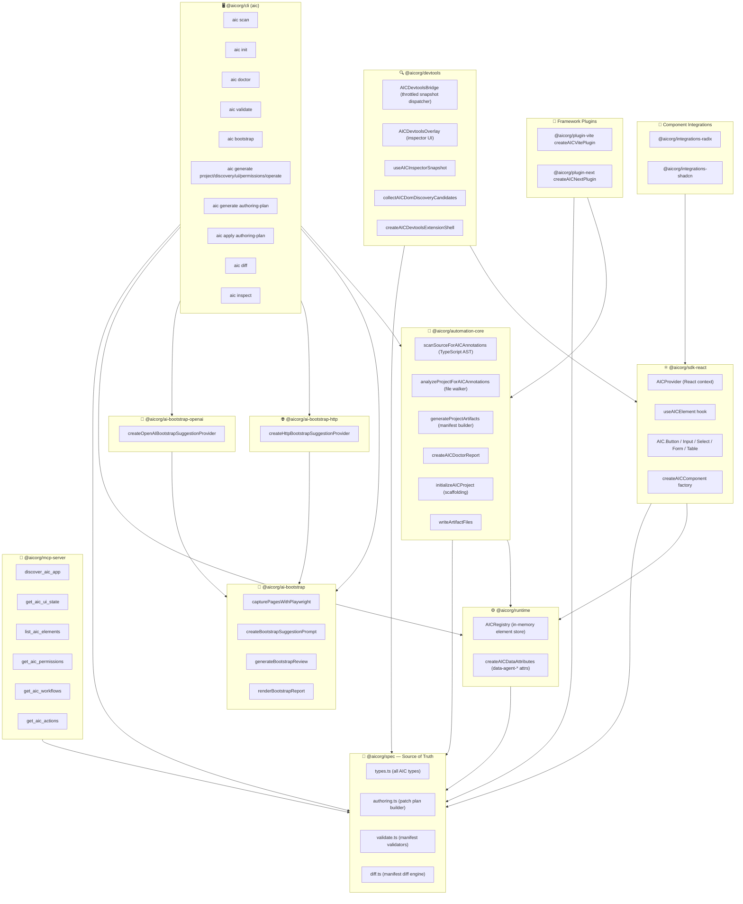
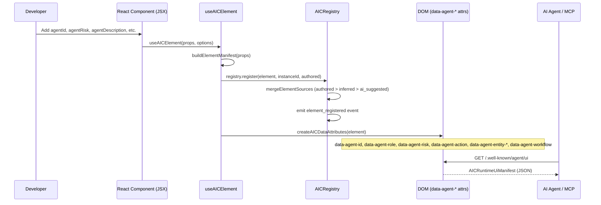
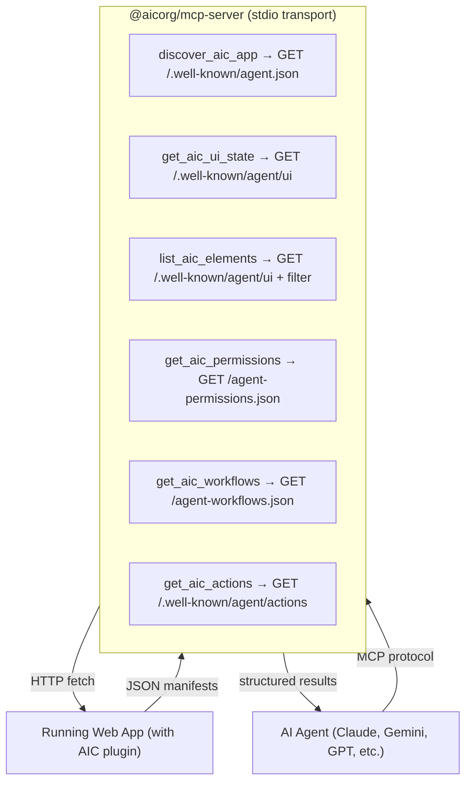
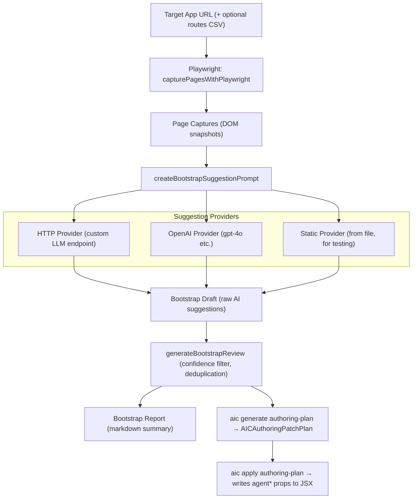
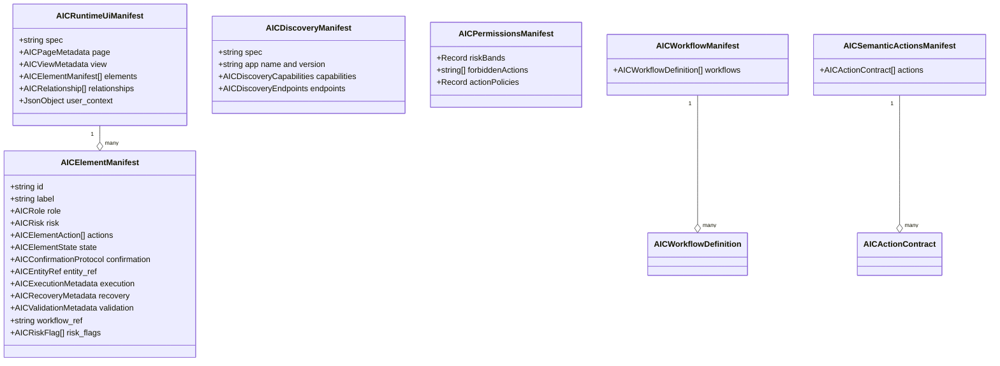
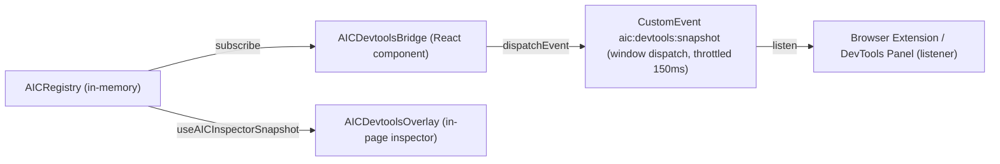

# AIC — Agent Interaction Control: Full Architecture

## System Overview

AIC is a **contract-first framework** that makes web apps reliably operable by AI agents. It does this by:

1. **Authoring** — developers annotate UI elements with stable `agent*` props
2. **Generating** — build-time tools extract those annotations into standardized JSON manifests
3. **Serving** — framework plugins expose manifests on `.well-known/` HTTP endpoints at runtime
4. **Consuming** — the MCP server exposes those manifests as tools that any AI agent can call

---

## Package Dependency Graph



---

## Runtime Data Flow (App in Browser)



---

## Build-Time Artifact Generation Flow

```mermaid
flowchart LR
    SRC["Source Files (.tsx / .jsx)"]

    subgraph AUTOMATION_CORE["@aicorg/automation-core"]
        TS["TypeScript AST Parser"]
        SCANNER["scanSourceForAICAnnotations → AICSourceScanMatch[]"]
        GENERATOR["generateProjectArtifacts"]
    end

    CONFIG["aic.project.json"]

    subgraph ARTIFACTS["Generated .well-known Artifacts"]
        A1["/.well-known/agent.json (discovery)"]
        A2["/.well-known/agent/ui (runtime UI manifest)"]
        A3["/.well-known/agent/actions (semantic actions)"]
        A4["/agent-permissions.json"]
        A5["/agent-workflows.json"]
        A6["/operate.txt (agent instructions)"]
        A7["/report.json (onboarding report)"]
    end

    SRC --> TS --> SCANNER --> GENERATOR
    CONFIG --> GENERATOR
    GENERATOR --> ARTIFACTS
```



---

## Well-Known Endpoint Map

| Endpoint | Manifest Type | Description |
|---|---|---|
| `/.well-known/agent.json` | `AICDiscoveryManifest` | App name, version, supported capabilities, endpoint URLs |
| `/.well-known/agent/ui` | `AICRuntimeUiManifest` | All rendered elements with full metadata |
| `/.well-known/agent/actions` | `AICSemanticActionsManifest` | Pre/post-conditions, completion signals, side-effects |
| `/agent-permissions.json` | `AICPermissionsManifest` | Risk-band policies, forbidden actions, reauth requirements |
| `/agent-workflows.json` | `AICWorkflowManifest` | Named multi-step workflows with entry points & rollback |
| `/operate.txt` | Plain text | Human-readable AIC summary for agent system prompts |

---

## MCP Server — AI Agent-Facing Tools



---

## Bootstrap Pipeline (AI-Assisted Annotation)



---

## CLI Command Reference

| Command | Purpose |
|---|---|
| `aic init [root]` | Scaffold `aic.project.json`, `AGENTS.md`, `GEMINI.md`, `CLAUDE.md`, `.cursor/rules/aic.mdc` |
| `aic scan <path>` | AST-scan for `agent*` props → JSON report of matches & diagnostics |
| `aic doctor [root]` | Audit onboarding files, config, source annotations, and workflows |
| `aic validate <kind> <file>` | Validate a manifest JSON against the spec schema |
| `aic bootstrap <url>` | Crawl with Playwright → LLM suggestions → bootstrap draft & report |
| `aic generate project <config>` | Full artifact generation from `aic.project.json` |
| `aic generate authoring-plan` | Build a proposal list from a runtime snapshot + bootstrap review |
| `aic apply authoring-plan` | Patch JSX source files with `agent*` props from a plan |
| `aic diff <kind> <before> <after>` | Diff two manifest versions (summary or detailed) |
| `aic inspect <file>` | Pretty-print and describe a manifest file |

---

## AIC Spec — Core Type Hierarchy



---

## Metadata Provenance Priority

The `AICRegistry` merges element registrations from three sources. Higher priority wins on conflicts:

```
ai_suggested  (lowest — from bootstrap AI)
    ↓
inferred      (middle — computed from DOM/AST)
    ↓
authored      (highest — explicit agent* props by developer)
```

All sources are tracked in the `provenance` field on each element manifest.

---

## Risk Levels and Confirmation Protocol

| Risk | Meaning | Typical Policy |
|---|---|---|
| `low` | Read-only or trivially reversible | No confirmation required |
| `medium` | Standard mutation | Agent may proceed autonomously |
| `high` | Significant irreversible change | Requires confirmation gate |
| `critical` | Financial / destructive / compliance | Human review + prompt template required |

**Risk flags** that further qualify risk: `financial`, `irreversible`, `external_side_effect`, `customer_visible`, `privacy_sensitive`, `destructive`, `compliance_relevant`

---

## Devtools — Development Bridge



---

## Project Config — `aic.project.json`

```json
{
  "appName": "My App",
  "framework": "vite",
  "projectRoot": ".",
  "viewId": "vite.root",
  "viewUrl": "http://localhost:5173",
  "hmr": true,
  "notes": ["initialized by aic init"],
  "permissions": {},
  "workflows": []
}
```

This single config file drives `aic generate project` to produce all 6+ manifest artifacts.

---

## Agent Onboarding File Checklist

AIC scaffolds and tracks these files via `aic init` and `aic doctor`:

| File | Kind | Purpose |
|---|---|---|
| `AGENTS.md` | canonical | Master AIC policy for all AI agents |
| `CLAUDE.md` | wrapper | Claude Code wrapper pointing to AGENTS.md |
| `GEMINI.md` | wrapper | Gemini wrapper pointing to AGENTS.md |
| `.github/copilot-instructions.md` | copilot_instructions | GitHub Copilot AIC instructions |
| `.cursor/rules/aic.mdc` | cursor_rule | Cursor IDE rule for AIC |
| `aic.project.json` | project_config | Build-time configuration |

---

## Key Design Principles

> [!IMPORTANT]
> **Contract-first, not selector-first.** Agents use stable `agentId` values as the interaction contract, never DOM selectors or visible text.

> [!TIP]
> **Explicit over inferred.** The `authored` provenance source always wins. Add explicit `agent*` props rather than relying on DOM inference.

> [!WARNING]
> **Never hand-edit generated JSON.** All artifacts under `.well-known/` and `report.json` are generated — regenerate them with `aic generate project`.
